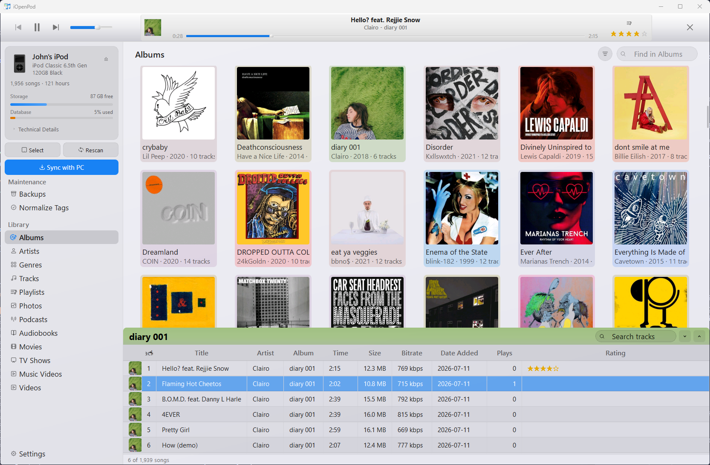
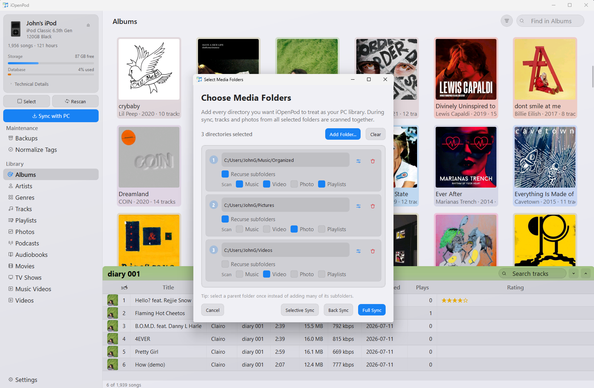
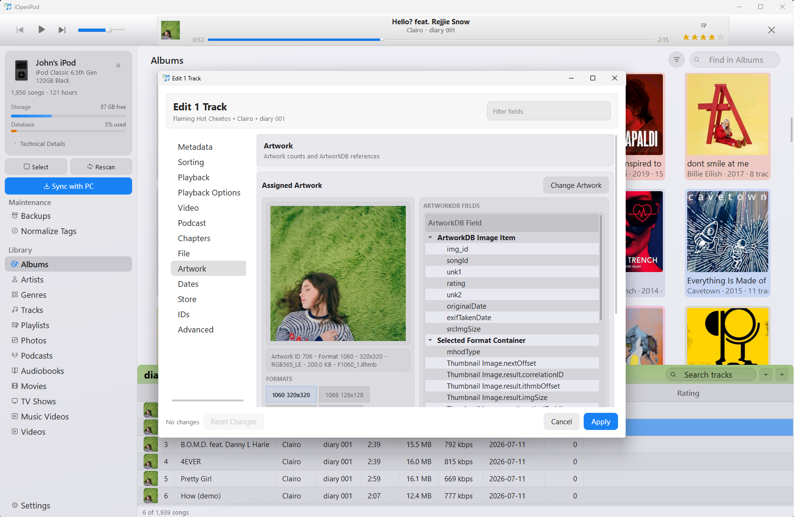
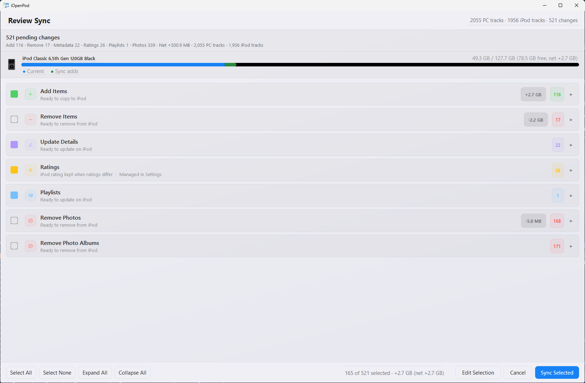
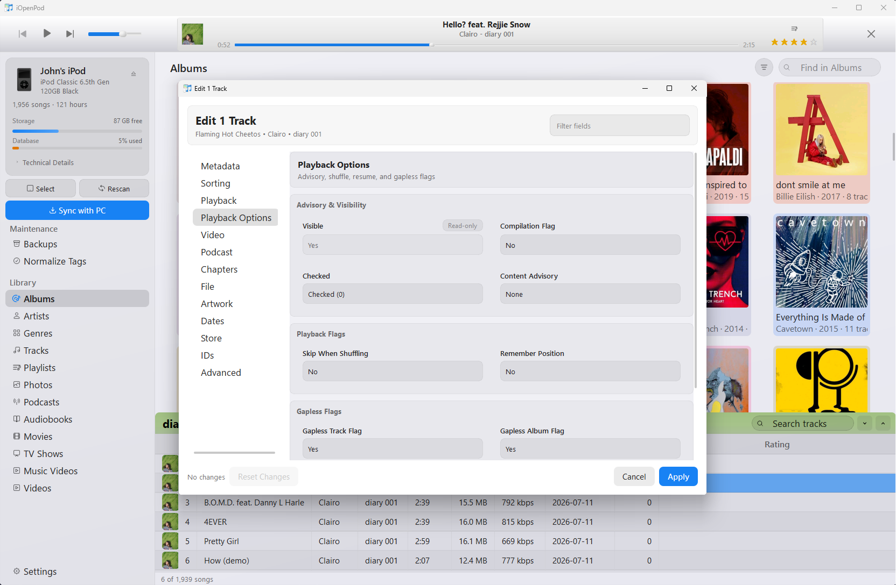
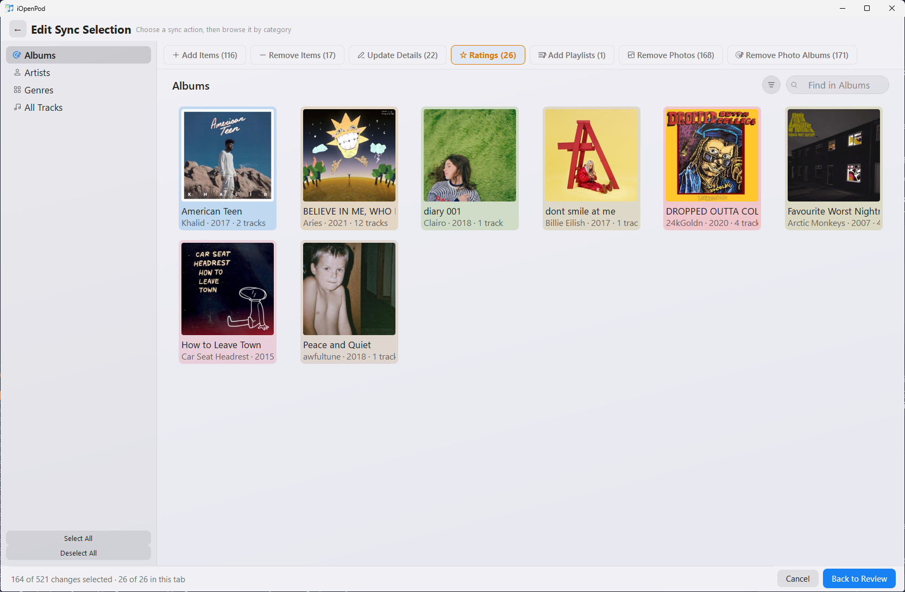
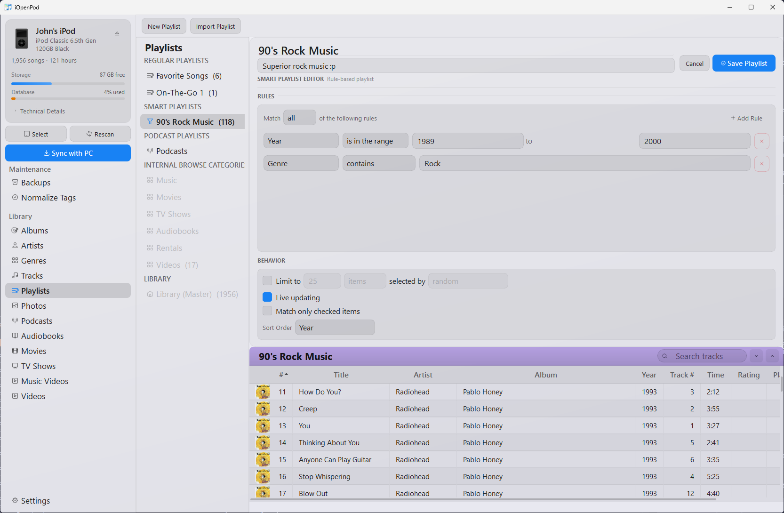
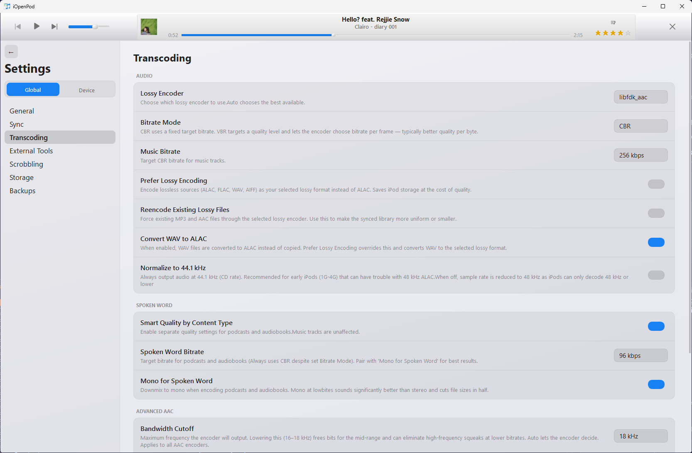

# iOpenPod

**A desktop iPod manager for Windows, macOS, and Linux.**

[](LICENSE)
[](#download)
[](https://github.com/TheRealSavi/iOpenPod/releases/latest)
[](https://discord.gg/9Yy499Tf5d)
[](https://ko-fi.com/johngibbons)

iOpenPod is a free, open-source desktop application for managing iPods without iTunes. It can browse and edit an iPod library, sync media from the PC, convert unsupported audio and video formats automatically, manage podcasts and playlists, write artwork and photos, and is built to preserve iPod-specific database behaviors.



## Screenshots

| Sync Workflow | Library Editing | Device Tools |
| --- | --- | --- |
|  |  |  |
|  |  |  |
|  |  |  |

---

## Download

Download the latest release for your platform. Native builds do not require a separate Python installation.
PyPI installs are recommended over native builds while native packaging is still being hardened.

### [Latest Release Builds](https://github.com/TheRealSavi/iOpenPod/releases/latest)

Need step-by-step, platform-specific setup help? See the [Install Help and Troubleshooting page](https://therealsavi.github.io/iOpenPod/install-help.html).

### Install from PyPI (Recommended)

iOpenPod is available as a Python package to download through `pip`, `pipx`, and `uv tool`.

| Method | Install | Run | Upgrade |
| --- | --- | --- | --- |
| `pip` | `python -m pip install iopenpod` | `iopenpod` | `python -m pip install --upgrade iopenpod` |
| `pipx` | `pipx install iopenpod` | `iopenpod` | `pipx upgrade iopenpod` |
| `uv tool` | `uv tool install iopenpod` | `iopenpod` | `uv tool upgrade iopenpod` |

Requires **Python 3.11+**.

After installing invoke in your shell with:

```bash
iopenpod
```

If `iopenpod` is not on your shell `PATH` yet, run `pipx ensurepath` for `pipx` installs or `uv tool update-shell` for `uv tool` installs.

Installs should be updated with the same tool used to install them.

> **Required tools:** Install [FFmpeg](https://ffmpeg.org/) with `ffprobe` for transcoding and media probing, and [Chromaprint](https://acoustid.org/chromaprint) for acoustic fingerprinting during sync.
> **Linux desktop dependencies:** If iOpenPod fails with a Qt `xcb` platform plugin error or crashes when pressing Ctrl, Alt, or Shift, install the XCB/XKeyboard runtime packages listed on the [Install Help and Troubleshooting page](https://therealsavi.github.io/iOpenPod/install-help.html#helper-tools).

---

## How to Use

1. **Connect your iPod** - Make sure it is mounted as a drive.
2. **Select the device** - Choose the detected iPod in iOpenPod. If the device is detected incorrectly, please open an issue.
3. **Browse and edit** - Manage tracks, playlists, podcasts, artwork, and metadata.
4. **Sync** - Choose PC media folder(s), configure the sync, review the proposed changes, then apply.

---

## Features

### Format Conversion

iOpenPod transcodes unsupported audio and video formats to iPod-compatible output using FFmpeg. `ffprobe` is needed to detect incompatible formats. Converted files are optionally cached so repeat syncs do not need to re-encode unchanged media.

### Podcasts

The built-in podcast manager can search, subscribe, download episodes, and sync them to an iPod.

### Scrobbling

ListenBrainz and Last.FM scrobbling can submit play history during sync.

### Media Types

Supports music, audiobooks, podcasts, videos, and photos.

### Drag and Drop

Files can be copied directly to the iPod by dragging them into the app, without using the full PC-folder sync workflow.

### Play Counts and Ratings

Play counts, ratings, and skip counts can be read from the iPod and synced back to the PC library metadata where supported.

### Artwork

Embedded or folder artwork is extracted, resized, and written to the iPod artwork database.

### Sync Review

Before writing changes, iOpenPod presents a review of planned additions, removals, metadata updates, and artwork changes.

### Playlists and Smart Playlists

Standard playlists and rule-based smart playlists can be browsed and managed.

### Backup and Rollback

iOpenPod saves a database snapshot before sync so earlier states can be restored if needed.

### Settings

Settings are available for transcoding, sync behavior, external tools, device handling, and related workflows.

---

## Supported iPods

iOpenPod supports most iPods. iPod Shuffle support is planned; iPod Touch support is not planned, but may be possible in the future.

| Device | Status | Notes |
| --- | --- | --- |
| iPod "Classic" (all generations 1st-7th) | Supported | |
| iPod Mini (all generations 1st and 2nd) | Supported | |
| iPod Nano (all generations 1st-7th) | Supported | |
| iPod Shuffle | Planned | Shuffle uses a different DB Structure. ETA ~4 mo |
| iPod Touch | Not planned | Touch requires accessing the device through non file-system protocols |

---

## For Contributing Developers

To run iOpenPod from source, clone the repository and use `uv sync`.

### Prerequisites

- **[uv](https://docs.astral.sh/uv/)** (Python package manager)
- **[FFmpeg](https://ffmpeg.org/)** with `ffprobe` (for transcoding and media probing)
- **[Chromaprint](https://acoustid.org/chromaprint)** (for fingerprinting)

### Setup

```bash
git clone https://github.com/TheRealSavi/iOpenPod.git
cd iOpenPod
uv sync
uv run iopenpod
```

`uv sync` installs dependencies into a local virtual environment.

### Project Layout

```text
iOpenPod/
├── src/
│   └── iopenpod/                   # Single installed Python package
│       ├── __main__.py             # Console and python -m entry point
│       ├── application/            # Application orchestration and sessions
│       ├── gui/                    # PyQt6 presentation
│       ├── sync/                   # Planning, execution, and transcoding
│       ├── device/                 # iPod discovery and capabilities
│       ├── podcasts/               # Podcast subscriptions and downloads
│       ├── itunesdb_parser/        # Reads iTunesDB
│       ├── itunesdb_writer/        # Writes iTunesDB
│       ├── artworkdb_parser/       # Reads ArtworkDB
│       ├── artworkdb_writer/       # Writes ArtworkDB and .ithmb files
│       ├── sqlitedb_writer/        # SQLite DB for Nano 6G/7G
│       └── assets/                 # Installed fonts, icons, glyphs, and iPod images
├── tests/
├── scripts/
└── pyproject.toml
```

### How Sync Works

The sync engine matches tracks between the PC library and iPod using acoustic fingerprints from [Chromaprint](https://acoustid.org/chromaprint). This allows the same recording to be matched across re-encodes, format changes, and metadata edits.

1. Scan both the PC media folder and iPod's iTunesDB
2. Compute or read cached fingerprints for each track
3. Diff by fingerprint to classify: new, removed, changed, or matched
4. Present the sync plan for review
5. Copy/transcode files, update the database, sync artwork and play counts
6. Rebuild the iTunesDB binary with the correct device-specific checksum

### Contributing

Useful contributions include:

- Hardware testing on different iPod models
- macOS and Linux testing
- Bug reports with steps to reproduce and `iopenpod.log`
- Focused pull requests for documented issues
- Joining the discord to coordinate

To find logs in iOpenPod, open **Settings > Storage**, then click **Open** next to **Log Location**.

Please open an issue before starting major changes, or use the [Discord server](https://discord.gg/9Yy499Tf5d) to discuss implementation details.

### Related Projects

- [libgpod](https://github.com/gtkpod/libgpod) — C library for iPod database access (the reference implementation this project learned from)
- [gtkpod](https://github.com/gtkpod/gtkpod) — GTK+ iPod manager
- [Rockbox](https://www.rockbox.org/) — Open-source firmware replacement for iPods

---

## Star History
  <!-- markdownlint-disable MD033 -->

<a href="https://www.star-history.com/?repos=therealsavi%2Fiopenpod&type=timeline&legend=top-left">
 <picture>
   <source media="(prefers-color-scheme: dark)" srcset="https://api.star-history.com/chart?repos=therealsavi/iopenpod&type=timeline&theme=dark&legend=top-left&sealed_token=aMCIa4pbVoIhlxj9qK6fW6xT1G5WPmVyftpcUHMTDCF-jNcb-ZD5ewReZkCnZxjUqpEYILAoYH1UP1nYDNyqT1PbhUaA09JI1Lrq1EZ2-mO9bYPn3EWaHyBxmimY3pGYha3MHx1aNeAXRuF0UoijWcDkCgvNBHYDbZNCLG6zG8wx6tDuSh8cmrTN0uas" />
   <source media="(prefers-color-scheme: light)" srcset="https://api.star-history.com/chart?repos=therealsavi/iopenpod&type=timeline&legend=top-left&sealed_token=aMCIa4pbVoIhlxj9qK6fW6xT1G5WPmVyftpcUHMTDCF-jNcb-ZD5ewReZkCnZxjUqpEYILAoYH1UP1nYDNyqT1PbhUaA09JI1Lrq1EZ2-mO9bYPn3EWaHyBxmimY3pGYha3MHx1aNeAXRuF0UoijWcDkCgvNBHYDbZNCLG6zG8wx6tDuSh8cmrTN0uas" />
   
 </picture>
</a>

 <!-- markdownlint-enable MD033 -->
---

## Support

iOpenPod is free and open source. Donations are optional and help support development.

[](https://ko-fi.com/johngibbons)

## License

MIT — see [LICENSE](LICENSE).
